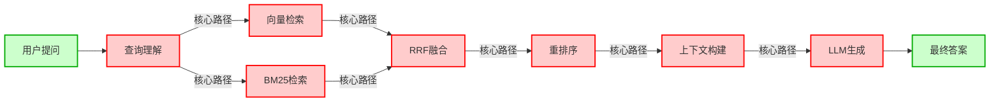

# 图谱路径高亮测试结果

## 测试问题

RAG混合检索里，用户的query从输入到生成答案，经过了哪几步？

## 自然语言答案

RAG混合检索的查询流程共8步：

1. **用户提问**：用户输入自然语言查询
2. **查询理解**：解析用户意图
3. **向量检索**：通过embedding向量进行语义相似度匹配
4. **BM25检索**：通过关键词进行精确匹配
5. **RRF融合**：用倒数排名融合合并向量检索和BM25的结果
6. **重排序**：用交叉编码器对融合结果进行精细排序
7. **上下文构建**：将排序后的相关文档组织成上下文
8. **LLM生成**：大模型根据上下文生成最终答案

核心流转路径：用户提问 → 查询理解 → 检索(向量+BM25) → RRF融合 → 重排序 → 上下文 → LLM生成 → 最终答案

## 带高亮的Mermaid图谱

## 图谱路径

- 节点：['用户提问', '查询理解', '向量检索', 'BM25检索', 'RRF融合', '重排序', '上下文构建', 'LLM生成', '最终答案']

- 边：[('用户提问', '查询理解'), ('查询理解', '向量检索'), ('查询理解', 'BM25检索'), ('向量检索', 'RRF融合'), ('BM25检索', 'RRF融合'), ('RRF融合', '重排序'), ('重排序', '上下文构建'), ('上下文构建', 'LLM生成'), ('LLM生成', '最终答案')]
