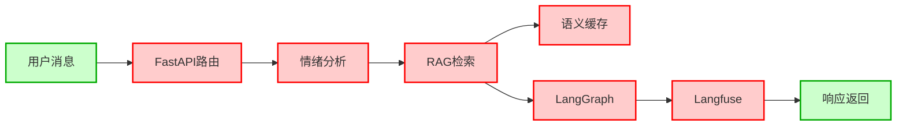

# YuanXinYeYu 仓库代码分析

## 仓库信息

| 字段 | 值 |
|------|-----|
| 仓库地址 | https://github.com/ky0404/YuanXinYeYu |
| 描述 | 情绪分析服务（含用户系统） |
| 主要技术栈 | FastAPI + Python + Chroma + 图谱RAG |
| 前端技术 | Vite + TypeScript |

## 代码解析结果

| 指标 | 数值 |
|------|------|
| 解析节点数 | 131 |
| 解析边数 | 729 |
| 模块数 | 10 |
| 类数 | 8 |
| 函数数 | 65 |

## API接口列表

### 核心路由模块

| 路由模块 | 前缀 | 功能 |
|---------|------|------|
| emo_router | /api/emo* | 情绪分析 |
| stream_router | /api/emo_analysis_stream | 流式输出 |
| auth_router | /api/auth* | 用户认证 |
| history_router | /api/history* | 对话历史 |
| feedback_router | /api/feedback* | 用户反馈 |
| ws_router | /api/ws* | WebSocket |
| profile_router | /api/profile* | 用户画像 |

### 详细API接口

| 接口 | 方法 | 功能 |
|------|------|------|
| / | GET | 健康检查，返回 {"status": "online", "version": "..."} |
| /api/emo_analysis | POST | 情绪分析（非流式） |
| /api/emo_analysis_stream | POST | 情绪分析（流式SSE） |
| /api/auth/login | POST | 用户登录 |
| /api/auth/register | POST | 用户注册 |
| /api/history/... | GET/POST | 对话历史管理 |
| /api/feedback/... | POST | 用户反馈 |
| /api/ws/... | WebSocket | 实时通信 |
| /api/profile/... | GET/PUT | 用户画像管理 |
| /metrics | GET | Prometheus监控指标 |

## 消息处理流程

```
用户发送消息
    ↓
FastAPI路由匹配 (api/main.py)
    ↓
情绪分析路由 (emo_router)
    ↓
RAG服务 (service/rag_service.py)
    ↓
├─→ 混合检索 (rag/hybrid/router.py)
│   ├─→ 向量检索 (rag/vector_store/chroma_store.py)
│   ├─→ 图谱检索 (rag/graph/graph_rag.py)
│   └─→ BM25检索 (rag/bm25_retriever.py)
│
├─→ 缓存服务 (service/cache_service.py)
│   └─→ SemanticCache (语义缓存)
│
├─→ 情绪分析 (core/analysis.py)
│   └─→ EmotionAnalyzer
│
├─→ LangGraph智能体 (agent/graph.py)
│   └─→ AgentState
│
└─→ 华为云NLP API (service/huawei_nlp.py)

    ↓
Langfuse追踪 (agent/langfuse_client.py)
    ↓
返回响应 (JSON/SSE)
```

## 核心模块架构

```
backend_core/
├── main.py              # 项目入口
├── api/
│   ├── main.py          # FastAPI应用创建 + 限流中间件
│   └── routes/
│       ├── emo_route.py       # 情绪分析路由
│       ├── auth_route.py      # 认证路由
│       ├── history_route.py  # 历史记录路由
│       ├── stream_route.py   # 流式输出路由
│       ├── feedback_route.py # 反馈路由
│       ├── ws_route.py        # WebSocket路由
│       └── profile_route.py  # 用户画像路由
├── agent/
│   ├── graph.py              # LangGraph智能体定义
│   └── langfuse_client.py    # Langfuse追踪客户端
├── rag/
│   ├── hybrid/router.py      # 混合检索路由
│   ├── graph/
│   │   ├── graph_rag.py      # 图谱RAG
│   │   └── graph_store.py    # 图谱存储
│   └── vector_store/
│       └── chroma_store.py   # Chroma向量存储
├── service/
│   ├── rag_service.py        # RAG服务封装
│   ├── cache_service.py      # 语义缓存服务
│   ├── profile_service.py    # 用户画像服务
│   └── huawei_nlp.py         # 华为云NLP
└── core/
    └── analysis.py           # 情绪分析核心逻辑
```

## 技术亮点

1. **混合检索**：向量检索 + 图谱检索 + BM25 三路融合
2. **语义缓存**：基于向量相似度的请求缓存
3. **LangGraph智能体**：基于图结构的对话流程编排
4. **Langfuse追踪**：完整的调用链追踪
5. **限流保护**：IP级 + 用户级双重限流
6. **Prometheus监控**：/metrics 端点暴露

## 带高亮的Mermaid图谱



## References

- [[my-learning-path/practice/code-graph-agent/index|Code Graph Agent项目主页]]
- [[my-learning-path/practice/code-graph-agent/upgrade/fast-test/test_results.md|FastAPI仓库验证测试]]