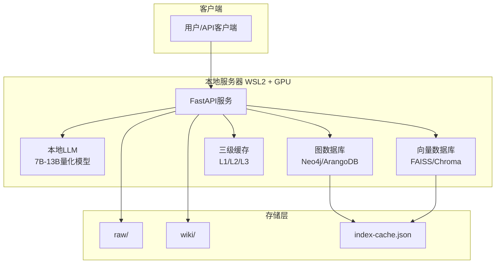
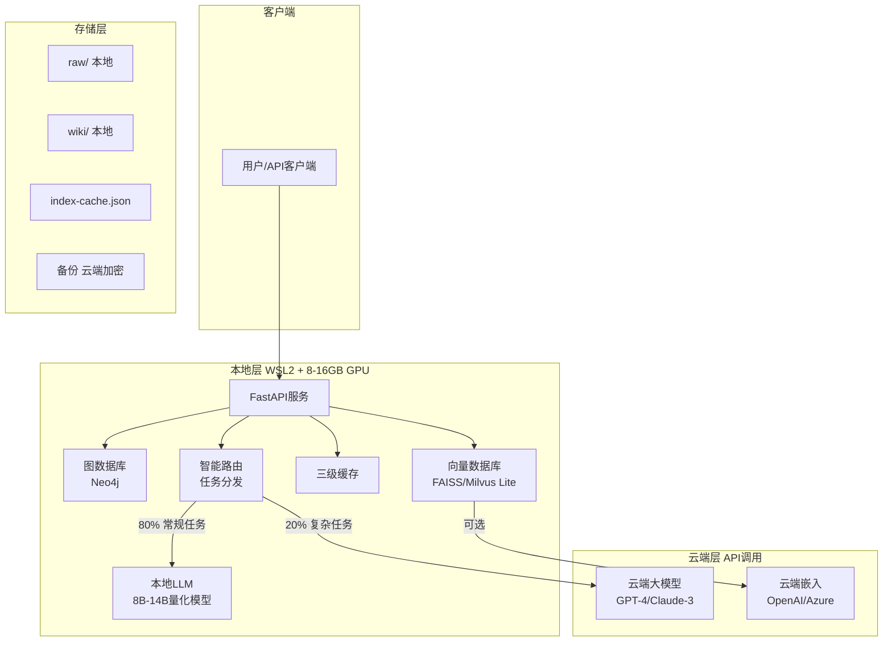
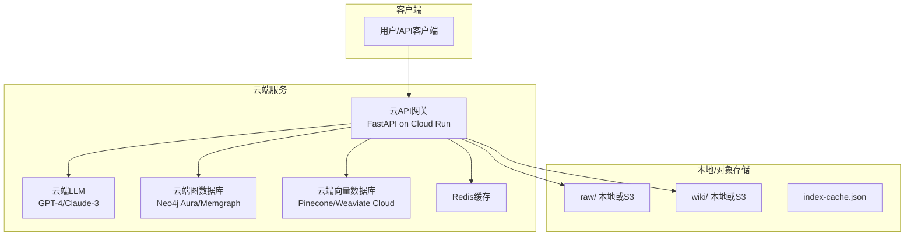

# 架构方案对比与选型

## 方案概览

### 方案A：本地优先架构（On-Premise First）

**适用场景**：对数据隐私要求极高、预算有限、可接受一定性能妥协

#### 架构图（Mermaid）

#### 技术栈
- **LLM**: Qwen-7B-Q4_K_M / Llama-3-8B-Instruct-Q4（量化后~4-6GB显存）
- **图数据库**: Neo4j Community（本地部署）或 ArangoDB
- **向量数据库**: FAISS（本地文件）或 Chroma（轻量级）
- **API框架**: FastAPI + Uvicorn
- **管线**: Python + LangChain（可选）

#### 成本分析

| 项目 | 一次性 | 月度 |
|------|--------|------|
| GPU硬件（如需要） | $2,000-3,000 | - |
| 电费（150W x 24h） | - | ~$20 |
| 维护人力 | - | 0.5人月 |
| **总计** | **$2,000-3,000** | **$20 + 人力** |

#### 优点
✅ 数据完全本地化，无泄露风险  
✅ 无月度API费用，长期成本低  
✅ 可定制模型微调  
✅ 符合最严格的数据合规要求  

#### 缺点
❌ 8GB显存限制模型能力（仅能运行7B-13B量化模型）  
❌ 复杂查询可能需要云端辅助  
❌ 需要自行维护硬件和软件  
❌ 扩展性受单机限制  

#### 实现要点
1. 使用llama.cpp或vllm部署量化模型
2. Neo4j存储实体关系，FAISS存储向量
3. 实现本地三级缓存机制
4. 定期模型更新与微调

#### 风险点
- **模型能力不足**：7B模型可能无法处理复杂推理 → 缓解：准备fallback到云端
- **硬件故障**：单机无冗余 → 缓解：定期备份到云端冷存储
- **扩展性瓶颈**：单GPU限制 → 缓解：设计未来多GPU扩展接口

---

### 方案B：混合架构（Hybrid - 推荐）

**适用场景**：平衡性能、成本与隐私，适合8-16GB显存环境

#### 架构图（Mermaid）

#### 技术栈
- **本地LLM**: Qwen-14B-Q4_K_M（~8GB显存）或 DeepSeek-V2-Lite（量化后）
- **云端LLM**: OpenAI GPT-4o-mini / Claude 3.5 Haiku（按量付费）
- **图数据库**: Neo4j Community
- **向量数据库**: FAISS（本地）+ 可选云端Pinecone（高扩展场景）
- **路由逻辑**: 基于任务复杂度、token预算动态路由
- **API框架**: FastAPI + Pydantic

#### 成本分析

| 项目             | 一次性              | 月度               |
| -------------- | ---------------- | ---------------- |
| GPU硬件（如需要）     | $2,000-3,000     | -                |
| 云端LLM API      | -                | $30-80           |
| 云端嵌入API        | -                | $10-20           |
| 电费（200W x 24h） | -                | ~$25             |
| 维护人力           | -                | 0.5-1人月          |
| **总计**         | **$2,000-3,000** | **$55-125 + 人力** |

#### 优点
✅ 平衡性能与成本，灵活调度  
✅ 8GB显存可运行14B量化模型处理大部分任务  
✅ 复杂任务可fallback到云端强力模型  
✅ 本地数据隐私 + 云端计算能力  
✅ 可根据预算动态调整本地/云端比例  

#### 缺点
❌ 架构复杂度较高，需要路由逻辑  
❌ 云端调用仍有数据外传风险（需脱敏）  
❌ 需要管理两套LLM的prompt格式转换  

#### 实现要点
1. **智能路由策略**：
   - 简单查询（L1/L2）→ 本地模型
   - 复杂推理、长文档总结 → 云端模型
   - 基于token成本预测的动态决策
2. **脱敏管道**：敏感数据在发送到云端前自动脱敏
3. **统一接口**：本地和云端模型封装为统一API
4. **降级策略**：云端故障时自动降级到本地模型

#### 风险点
- **成本失控**：云端调用过多 → 缓解：设置月度预算上限、告警
- **延迟增加**：云端调用RTT ~200-500ms → 缓解：异步调用、结果缓存
- **数据泄露**：脱敏不彻底 → 缓解：使用本地NER模型预检测敏感信息

---

### 方案C：云端为主架构（Cloud-Native）

**适用场景**：快速上线、无本地GPU、需要最强模型能力

#### 架构图（Mermaid）

#### 技术栈
- **LLM**: OpenAI GPT-4o / Claude 3.5 Sonnet（最强推理能力）
- **图数据库**: Neo4j Aura（托管服务）或 Memgraph Cloud
- **向量数据库**: Pinecone / Weaviate Cloud
- **API托管**: Cloud Run / AWS Lambda / Azure Container Instances
- **存储**: AWS S3 / Azure Blob Storage
- **监控**: Prometheus + Grafana Cloud

#### 成本分析

| 项目 | 一次性 | 月度 |
|------|--------|------|
| 云端LLM API | - | $200-500 |
| 图数据库托管 | - | $50-150 |
| 向量数据库托管 | - | $30-100 |
| 对象存储 | - | $5-20 |
| API托管 | - | $20-50 |
| 维护人力 | - | 0.3-0.5人月 |
| **总计** | **$0** | **$305-820 + 人力** |

#### 优点
✅ 无需本地GPU，初始投入为0  
✅ 使用最强模型，性能最优  
✅ 自动扩展，支持百万级文档  
✅ 托管服务，维护成本低  
✅ 快速上线（2-4周）  

#### 缺点
❌ 月度成本高，长期使用不划算  
❌ 所有数据上传云端，隐私风险最高  
❌ 受云端服务SLA限制  
❌ 数据出口成本（如需要迁移）  

#### 实现要点
1. 使用Terraform/Pulumi管理云基础设施
2. 实施严格的数据加密（传输中+静态）
3. 设计成本监控与预算告警
4. 实现多云部署能力（避免厂商锁定）

#### 风险点
- **成本失控**：API调用量暴增 → 缓解：严格配额、速率限制
- **服务中断**：云厂商故障 → 缓解：多云部署、本地缓存
- **合规问题**：数据跨境 → 缓解：选择有本地数据中心的云厂商

---

## 方案对比总结

| 维度 | 方案A：本地优先 | 方案B：混合（推荐） | 方案C：云端为主 |
|------|----------------|-------------------|----------------|
| **8GB显存适配** | ✅ 可运行7B-13B | ✅ 可运行14B + 云端辅助 | ✅ 不依赖本地GPU |
| **初始成本** | $2,000-3,000 | $2,000-3,000 | $0 |
| **月度成本** | $20 + 人力 | $55-125 + 人力 | $305-820 + 人力 |
| **数据隐私** | 🔒 最高 | 🔒 高（可脱敏） | ⚠️ 较低 |
| **模型能力** | ⚠️ 中等（7B-13B） | ✅ 高（本地+云端） | ✅ 最高（GPT-4级） |
| **扩展性** | ⚠️ 单机限制 | ✅ 可扩展 | ✅ 自动扩展 |
| **维护复杂度** | ⚠️ 高（自行维护） | ⚠️ 中高（混合维护） | ✅ 低（托管服务） |
| **上线速度** | ⚠️ 2-3个月 | ⚠️ 2-3个月 | ✅ 2-4周 |

## 针对8GB显存的选型建议

**强烈推荐：方案B（混合架构）**

理由：
1. **显存充分利用**：8GB可运行Qwen-14B-Q4_K_M（~7.5GB显存），覆盖80%常规任务
2. **成本可控**：月度$55-125，远低于云端为主的$305-820
3. **隐私保护**：敏感数据本地处理，仅非敏感复杂任务上云
4. **灵活扩展**：未来可调整本地/云端比例，或迁移到全本地/全云端
5. **风险分散**：不依赖单一环境，云端故障可降级本地

### 推荐的本地模型配置（8GB显存）

| 模型 | 量化格式 | 显存占用 | 适用任务 |
|------|----------|----------|----------|
| Qwen-7B-Chat | Q4_K_M | ~4.2GB | L1/L2查询、简单ingest |
| Qwen-14B-Chat | Q4_K_M | ~7.8GB | 复杂ingest、中等推理 |
| DeepSeek-V2-Lite | Q4_K_M | ~6.5GB | 长文档处理、代码生成 |

使用vLLM或llama.cpp部署，支持连续批处理提升吞吐量。

---

## References

- [[llm-wiki-upgrade-plan]]
- [[data-model-design]]
- [[roadmap-6-12-months]]
- [[cost-estimation]]
