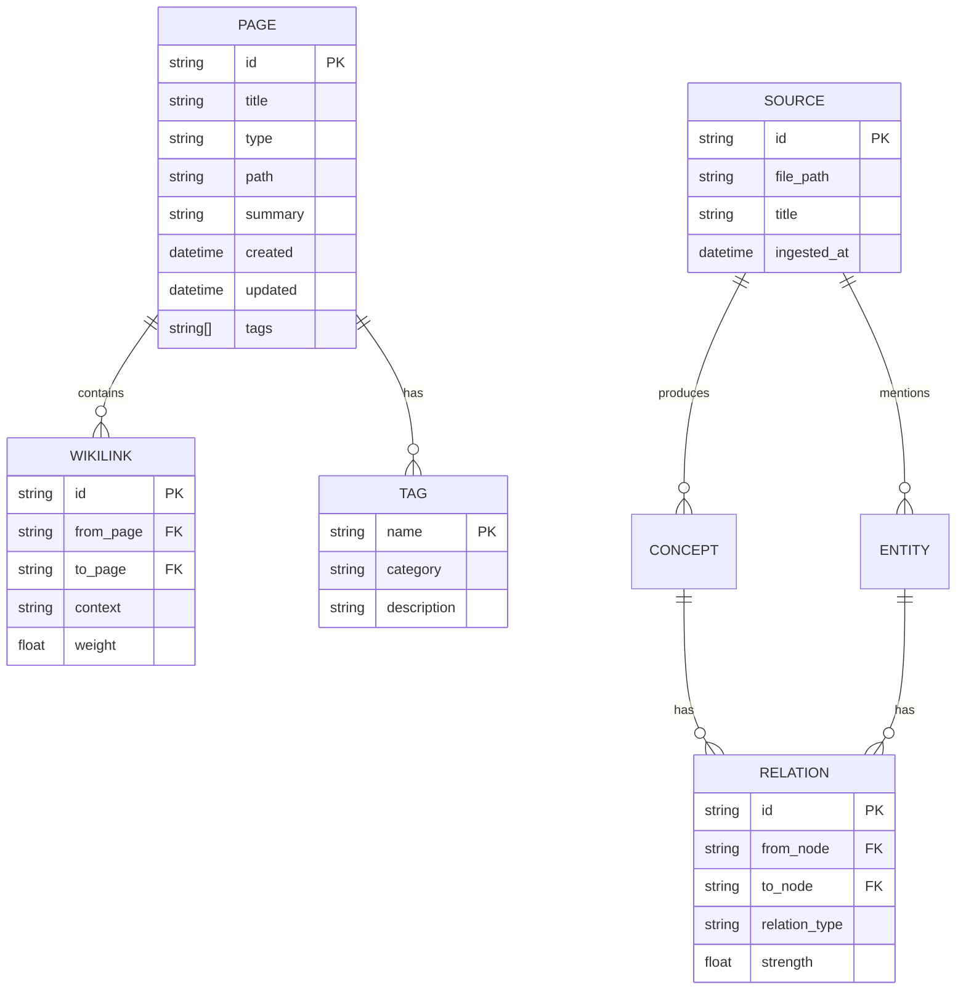

# 数据模型与图结构设计

## 概览

本设计采用**混合存储架构**：
- **图数据库**（Neo4j）：存储实体、概念、关系（结构化知识）
- **向量数据库**（FAISS/Milvus）：存储文本嵌入（语义检索）
- **对象存储**（文件系统）：存储原始Markdown文件（持久化）

## 核心实体关系图（ERD）



## 图数据库模型（Neo4j）

### 节点标签（Node Labels）

#### 1. `Page` 节点（通用页面）
```cypher
(:Page {
  id: String,          // 唯一标识，如 "concepts/llm-wiki"
  title: String,        // 页面标题
  type: String,         // source | concept | entity | synthesis
  path: String,         // 文件路径
  summary: String,      // L2摘要（2-3句）
  created: DateTime,    // 创建时间
  updated: DateTime,    // 更新时间
  tags: [String],       // 标签数组
  l1_cached: Boolean   // 是否已缓存到L1
})
```

#### 2. `Source` 节点（原始素材）
```cypher
(:Source {
  id: String,
  title: String,
  file_path: String,
  ingested_at: DateTime,
  raw_size: Int,        // 原始文件大小
  processed: Boolean    // 是否已处理
})
```

#### 3. `Concept` 节点（概念/方法论）
```cypher
(:Concept {
  id: String,
  title: String,
  definition: String,   // 详细定义（L3内容）
  category: String,     // 分类（如 "ai", "methodology"）
  related_terms: [String]
})
```

#### 4. `Entity` 节点（实体/工具/人物）
```cypher
(:Entity {
  id: String,
  title: String,
  entity_type: String,  // person | tool | organization
  description: String,
  homepage: String,     // 可选
  affiliations: [String]
})
```

#### 5. `Tag` 节点（标签）
```cypher
(:Tag {
  name: String,
  category: String,     // 自动分类：ai, tool, method, etc.
  usage_count: Int      // 使用次数（用于热度排序）
})
```

### 关系类型（Relationship Types）

#### 核心关系
```cypher
// Wikilinks（页面间引用）
(:Page)-[:LINKS_TO {weight: Float, context: String}]->(:Page)

// 类型继承
(:Source)-[:OF_TYPE]->(:Page)
(:Concept)-[:OF_TYPE]->(:Page)
(:Entity)-[:OF_TYPE]->(:Page)

// 知识关系
(:Concept)-[:RELATES_TO {relation_type: String, strength: Float}]->(:Concept)
(:Entity)-[:MENTIONED_IN]->(:Source)
(:Concept)-[:MENTIONED_IN]->(:Source)

// 标签关系
(:Page)-[:HAS_TAG]->(:Tag)

// 合成关系
(:Synthesis)-[:SYNTHESIZES]->(:Page)
```

### 索引与约束
```cypher
// 唯一性约束
CREATE CONSTRAINT page_id_unique FOR (p:Page) REQUIRE p.id IS UNIQUE;
CREATE CONSTRAINT source_id_unique FOR (s:Source) REQUIRE s.id IS UNIQUE;
CREATE CONSTRAINT tag_name_unique FOR (t:Tag) REQUIRE t.name IS UNIQUE;

// 索引（加速查询）
CREATE INDEX page_type_idx FOR (p:Page) ON (p.type);
CREATE INDEX page_tags_idx FOR (p:Page) ON (p.tags);
CREATE INDEX page_title_idx FOR (p:Page) ON (p.title);
CREATE INDEX concept_category_idx FOR (c:Concept) ON (c.category);
```

---

## 向量数据库模型（FAISS/Milvus）

### 集合/表结构

#### `page_embeddings` 表（页面向量）
```json
{
  "collection_name": "page_embeddings",
  "dimension": 768,  // 嵌入维度（如bge-large-zh为1024，ada-002为1536）
  "index_type": "IVF_FLAT",  // FAISS索引类型
  "metric_type": "IP",  // 内积（余弦相似度）
  "fields": {
    "id": "String",           // 对应Page.id
    "vector": [Float],        // 嵌入向量
    "title": "String",        // 用于检索结果展示
    "type": "String",         // 过滤用
    "summary": "String",      // L2摘要
    "tags": [String],         // 过滤用
    "updated": "DateTime"     // 用于增量更新
  }
}
```

#### `chunk_embeddings` 表（段落向量 - 用于RAG）
```json
{
  "collection_name": "chunk_embeddings",
  "dimension": 768,
  "index_type": "IVF_FLAT",
  "metric_type": "IP",
  "fields": {
    "id": "String",           // 格式：page_id#chunk_index
    "vector": [Float],
    "page_id": "String",      // 所属页面
    "chunk_index": "Int",     // 段落序号
    "content": "String",      // 段落文本（L3内容片段）
    "token_count": "Int"      // token数（用于预算控制）
  }
}
```

### 嵌入模型选型

| 模型 | 维度 | 适用场景 | 部署方式 |
|------|------|----------|----------|
| **bge-large-zh-v1.5** | 1024 | 中文/英文混合 | 本地（~2GB） |
| **text-embedding-ada-002** | 1536 | 纯英文 | 云端API |
| **all-MiniLM-L6-v2** | 384 | 轻量级、快速 | 本地（~80MB） |
| **m3e-base** | 768 | 中文优化 | 本地（~400MB） |

**推荐**：本地部署 `bge-large-zh-v1.5`（支持中英混合，质量高，成本低）

---

## 三级渐进披露缓存结构

### L1：元数据缓存（index-cache.json）
```json
{
  "version": "1.0",
  "last_updated": "2026-04-29T21:43:57",
  "total_files": 60,
  "files": {
    "concepts/llm-wiki": {
      "title": "LLM Wiki",
      "type": "concept",
      "tags": ["wiki", "知识管理"],
      "summary": "LLM Wiki 是一种基于编译增强生成（CAG）的知识管理系统...",
      "l1_cached": true
    }
  }
}
```

### L2：摘要缓存（数据库或单独文件）
```json
// 存储在 page_summaries/ 目录或数据库
{
  "page_id": "concepts/llm-wiki",
  "summary": "完整摘要（2-3段）...",
  "key_points": ["要点1", "要点2"],
  "related_pages": ["concepts/cag", "concepts/rag"],
  "last_computed": "2026-04-29T21:43:57"
}
```

### L3：完整内容（原始Markdown文件）
```
wiki/
├── sources/
│   └── llm-wiki.md  # 完整内容
├── concepts/
│   └── llm-wiki.md
└── ...
```

---

## 数据迁移映射

### 从现有结构到新模型

| 现有文件 | 新图节点 | 向量集合 | 备注 |
|----------|----------|----------|------|
| wiki/**/*.md | :Page + :Concept/:Entity/:Source | page_embeddings | 按frontmatter type映射 |
| index-cache.json | :Page 节点属性 | - | 迁移至Neo4j |
| [[wikilinks]] | :LINKS_TO 关系 | - | 解析所有页面提取 |
| raw/*.md | :Source 节点 | chunk_embeddings | 保留原始文件 |

### 迁移脚本伪代码
```python
# 1. 遍历wiki/所有.md文件
for md_file in glob("wiki/**/*.md"):
    frontmatter = parse_yaml_frontmatter(md_file)
    content = read_content(md_file)
    
    # 2. 创建图节点
    page_node = neo4j.create_node(
        label=map_type_to_label(frontmatter['type']),
        properties={
            'id': relative_path,
            'title': frontmatter['title'],
            'type': frontmatter['type'],
            'summary': extract_summary(content),
            'tags': frontmatter['tags'],
            'created': frontmatter['created'],
            'updated': frontmatter['updated']
        }
    )
    
    # 3. 生成向量并存储
    vector = embed_model.encode(content)
    faiss_index.add(vector, metadata={'id': relative_path})
    
    # 4. 提取wikilinks并创建关系
    wikilinks = extract_wikilinks(content)
    for link in wikilinks:
        neo4j.create_relationship(
            from_node=page_node,
            to_node=link.target,
            rel_type='LINKS_TO'
        )
```

---

## 查询优化策略

### 1. 三级披露查询流程
```
用户查询
  ↓
L1: 从 index-cache.json 获取所有页面元数据（<1ms）
  ↓
判断相关性（基于tags, title）
  ↓
L2: 读取相关页面的 summary（<10ms）
  ↓
确认需要详细内容
  ↓
L3: 向量检索 + 读取完整 .md 文件（<100ms）
```

### 2. 混合检索策略
```python
def hybrid_search(query, top_k=5):
    # 1. 向量检索（语义相似）
    vector_results = faiss_index.search(query_vector, top_k=20)
    
    # 2. 图遍历（结构化关系）
    graph_results = neo4j.query("""
        MATCH (p:Page)-[:LINKS_TO*1..2]-(related)
        WHERE p.id IN $page_ids
        RETURN related.id, count(*) as strength
        ORDER BY strength DESC
        LIMIT $top_k
    """, page_ids=[r['id'] for r in vector_results])
    
    # 3. 融合排序（RRF: Reciprocal Rank Fusion）
    fused = rrf_fusion(vector_results, graph_results)
    
    return fused[:top_k]
```

---

## References

- [[llm-wiki-upgrade-plan]]
- [[architecture-options]]
- [[api-surface-design]]
