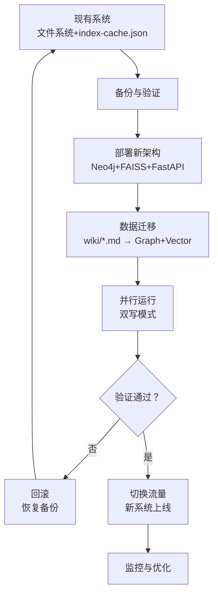

# 迁移计划与实施步骤

## 迁移概览



---

## 1. 迁移前准备

### 1.1 环境评估
| 检查项 | 命令/方法 | 期望结果 |
|--------|-----------|----------|
| GPU可用性 | `nvidia-smi` | 显示GPU信息，显存≥8GB |
| WSL2版本 | `wsl --list --verbose` | VERSION 2 |
| 磁盘空间 | `df -h` | 可用空间>50GB |
| Docker状态 | `docker ps` | 守护进程运行中 |
| Python版本 | `python --version` | ≥3.10 |

### 1.2 备份策略
```bash
#!/bin/bash
# backup_pre_migration.sh

BACKUP_DIR="/backups/$(date +%Y%m%d_%H%M%S)"
mkdir -p "$BACKUP_DIR"

echo "备份开始: $(date)"

# 1. 备份整个wiki目录
tar -czf "$BACKUP_DIR/wiki_backup.tar.gz" /mnt/d/projects/wiki/wiki/

# 2. 备份index-cache.json
cp /mnt/d/projects/wiki/wiki/index-cache.json "$BACKUP_DIR/"

# 3. 导出Neo4j（如果已有）
# docker exec neo4j neo4j-admin dump --database=neo4j --to=/backups/neo4j.dump

# 4. 记录当前文件数
find /mnt/d/projects/wiki/wiki -name "*.md" | wc -l > "$BACKUP_DIR/file_count.txt"

# 5. 生成校验和
cd /mnt/d/projects/wiki/wiki && find . -name "*.md" -exec md5sum {} \; > "$BACKUP_DIR/md5sums.txt"

echo "备份完成: $BACKUP_DIR"
```

### 1.3 依赖安装
```bash
# Docker Compose 配置
cat > /mnt/d/projects/wiki/docker-compose.yml <<EOF
version: '3.8'

services:
  neo4j:
    image: neo4j:5.18-community
    environment:
      - NEO4J_AUTH=neo4j/${NEO4J_PASSWORD}
      - NEO4J_dbms_security_procedures_unrestricted=apoc.*
    ports:
      - "7474:7474"
      - "7687:7687"
    volumes:
      - neo4j_data:/data
    deploy:
      resources:
        limits:
          memory: 4G

  faiss:
    image: python:3.10-slim
    volumes:
      - ./app:/app
    working_dir: /app
    command: python -m app.vector_server
    ports:
      - "8001:8001"

  api:
    build: ./app
    ports:
      - "8000:8000"
    environment:
      - NEO4J_URI=bolt://neo4j:7687
      - NEO4J_USER=neo4j
      - NEO4J_PASSWORD=${NEO4J_PASSWORD}
    depends_on:
      - neo4j
    deploy:
      resources:
        reservations:
          devices:
            - driver: nvidia
              count: 1
              capabilities: [gpu]

volumes:
  neo4j_data:
EOF
```

---

## 2. 数据迁移脚本

### 2.1 迁移脚本核心逻辑
```python
# migrate/migrator.py
import os
import re
from typing import Dict, List
from neo4j import GraphDatabase
import faiss
import numpy as np
from sentence_transformers import SentenceTransformer

class WikiMigrator:
    def __init__(self, wiki_path: str, neo4j_uri: str, neo4j_auth: tuple):
        self.wiki_path = wiki_path
        self.driver = GraphDatabase.driver(neo4j_uri, auth=neo4j_auth)
        self.embed_model = SentenceTransformer('BAAI/bge-large-zh-v1.5')
        self.faiss_index = None
        self.migration_log = []
    
    def parse_frontmatter(self, content: str) -> Dict:
        """解析YAML frontmatter"""
        import yaml
        match = re.match(r'^---\n(.*?)\n---', content, re.DOTALL)
        if match:
            return yaml.safe_load(match.group(1))
        return {}
    
    def extract_wikilinks(self, content: str) -> List[str]:
        """提取[[wikilinks]]"""
        return re.findall(r'\[\[([^\]|]+)(?:\|([^\]]+))?\]\]', content)
    
    def migrate_all(self):
        """执行全量迁移"""
        print("开始迁移...")
        
        # 1. 收集所有.md文件
        md_files = []
        for root, dirs, files in os.walk(self.wiki_path):
            for file in files:
                if file.endswith('.md') and not file.startswith('.'):
                    md_files.append(os.path.join(root, file))
        
        print(f"发现 {len(md_files)} 个Markdown文件")
        
        # 2. 迁移每个文件
        for filepath in md_files:
            try:
                self.migrate_file(filepath)
            except Exception as e:
                self.log_error(filepath, str(e))
        
        # 3. 创建关系
        self.create_wikilink_relations()
        
        # 4. 构建FAISS索引
        self.build_faiss_index()
        
        # 5. 生成报告
        self.generate_report()
    
    def migrate_file(self, filepath: str):
        """迁移单个文件"""
        rel_path = os.path.relpath(filepath, self.wiki_path)
        print(f"迁移: {rel_path}")
        
        with open(filepath, 'r', encoding='utf-8') as f:
            content = f.read()
        
        # 解析frontmatter
        metadata = self.parse_frontmatter(content)
        
        # 创建Neo4j节点
        with self.driver.session() as session:
            session.run("""
                MERGE (p:Page {id: $id})
                SET p.title = $title,
                    p.type = $type,
                    p.path = $path,
                    p.summary = $summary,
                    p.created = datetime($created),
                    p.updated = datetime($updated),
                    p.tags = $tags
            """, id=rel_path,
                title=metadata.get('title', ''),
                type=metadata.get('type', ''),
                path=rel_path,
                summary=self.extract_summary(content),
                created=metadata.get('created', ''),
                updated=metadata.get('updated', ''),
                tags=metadata.get('tags', [])
            )
        
        self.migration_log.append({
            'file': rel_path,
            'status': 'success'
        })
    
    def create_wikilink_relations(self):
        """创建wikilink关系"""
        print("创建wikilink关系...")
        
        with self.driver.session() as session:
            # 获取所有页面
            result = session.run("MATCH (p:Page) RETURN p.id as id, p.path as path")
            pages = {r['id']: r['path'] for r in result}
            
            # 遍历每个页面，提取wikilinks
            for page_id in pages.keys():
                page_result = session.run("MATCH (p:Page {id: $id}) RETURN p", id=page_id)
                page = page_result.single()['p']
                
                # 读取文件内容
                filepath = os.path.join(self.wiki_path, page_id)
                if not os.path.exists(filepath):
                    continue
                
                with open(filepath, 'r', encoding='utf-8') as f:
                    content = f.read()
                
                # 提取wikilinks
                links = self.extract_wikilinks(content)
                
                # 创建关系
                for link in links:
                    target = link[0].strip()
                    if target in pages:
                        session.run("""
                            MATCH (a:Page {id: $from_id})
                            MATCH (b:Page {id: $to_id})
                            MERGE (a)-[:LINKS_TO {weight: 1.0}]->(b)
                        """, from_id=page_id, to_id=target)
    
    def build_faiss_index(self):
        """构建FAISS向量索引"""
        print("构建FAISS索引...")
        
        # 收集所有页面的摘要
        summaries = []
        ids = []
        
        with self.driver.session() as session:
            result = session.run("MATCH (p:Page) RETURN p.id as id, p.summary as summary")
            for record in result:
                ids.append(record['id'])
                summaries.append(record['summary'])
        
        # 生成向量
        embeddings = self.embed_model.encode(summaries)
        
        # 创建FAISS索引
        dimension = embeddings.shape[1]
        self.faiss_index = faiss.IndexFlatIP(dimension)  # 内积（余弦相似度）
        self.faiss_index.add(embeddings.astype(np.float32))
        
        # 保存索引和ID映射
        faiss.write_index(self.faiss_index, "/mnt/d/projects/wiki/faiss_index.bin")
        with open("/mnt/d/projects/wiki/faiss_ids.json", "w") as f:
            import json
            json.dump(ids, f)
        
        print(f"FAISS索引已保存，包含 {len(ids)} 个向量")
    
    def extract_summary(self, content: str) -> str:
        """从内容中提取摘要（前200字）"""
        # 移除frontmatter
        content_no_fm = re.sub(r'^---\n.*?\n---', '', content, flags=re.DOTALL)
        # 移除wikilinks格式，保留文本
        content_clean = re.sub(r'\[\[([^\]|]+)(?:\|([^\]]+))?\]\]', r'\2\1', content_no_fm)
        # 取前200字符
        return content_clean.strip()[:200]
    
    def log_error(self, filepath: str, error: str):
        print(f"错误: {filepath} - {error}")
        self.migration_log.append({
            'file': filepath,
            'status': 'error',
            'error': error
        })
    
    def generate_report(self):
        """生成迁移报告"""
        success_count = sum(1 for log in self.migration_log if log['status'] == 'success')
        error_count = sum(1 for log in self.migration_log if log['status'] == 'error')
        
        report = f"""
# 迁移报告
生成时间: {datetime.now().isoformat()}

## 统计
- 总文件数: {len(self.migration_log)}
- 成功: {success_count}
- 失败: {error_count}

## 失败文件
"""
        for log in self.migration_log:
            if log['status'] == 'error':
                report += f"- {log['file']}: {log['error']}\n"
        
        with open("/mnt/d/projects/wiki/migration_report.md", "w") as f:
            f.write(report)
        
        print(report)

if __name__ == "__main__":
    migrator = WikiMigrator(
        wiki_path="/mnt/d/projects/wiki/wiki",
        neo4j_uri="bolt://localhost:7687",
        neo4j_auth=("neo4j", os.getenv("NEO4J_PASSWORD"))
    )
    migrator.migrate_all()
```

---

## 3. 并行运行阶段（双写模式）

### 3.1 双写配置
```python
# app/writer/dual_write.py
class DualWriteManager:
    """新数据同时写入旧系统和新系统"""
    
    def ingest_new_file(self, file_path: str):
        # 1. 旧系统写入（index-cache.json + .md文件）
        self.legacy_ingest(file_path)
        
        # 2. 新系统写入（Neo4j + FAISS）
        self.new_ingest(file_path)
        
        # 3. 记录一致性哈希
        self.record_consistency_hash(file_path)
    
    def compare_results(self, file_path: str) -> bool:
        """对比新旧系统结果"""
        # 读取旧系统
        legacy_data = self.read_legacy(file_path)
        # 读取新系统
        new_data = self.read_new(file_path)
        
        # 对比（忽略时间戳）
        return self.normalize(legacy_data) == self.normalize(new_data)
```

### 3.2 流量切换策略
| 阶段 | 流量比例 | 持续时间 | 验证重点 |
|------|----------|----------|----------|
| 1. 验证环境 | 0% | 1周 | 功能完整性 |
| 2. 小流量 | 10% | 3天 | 性能、错误率 |
| 3. 中流量 | 50% | 3天 | 稳定性 |
| 4. 全流量 | 100% | - | 监控告警 |

```python
# 逐步切换流量
TRAFFIC_SPLIT = {
    "phase_1": {"legacy": 100, "new": 0},
    "phase_2": {"legacy": 90, "new": 10},
    "phase_3": {"legacy": 50, "new": 50},
    "phase_4": {"legacy": 0, "new": 100}
}

def route_request(request):
    phase = get_current_phase()
    if random.randint(1, 100) <= TRAFFIC_SPLIT[phase]["new"]:
        return handle_with_new_system(request)
    else:
        return handle_with_legacy_system(request)
```

---

## 4. 回滚计划

### 4.1 回滚触发条件
- 新系统错误率>5%
- P99延迟>5s（目标1s）
- 数据不一致率>1%
- 用户投诉>10次/天

### 4.2 回滚步骤
```bash
#!/bin/bash
# rollback.sh

echo "开始回滚..."

# 1. 停止新系统
docker-compose stop api neo4j faiss

# 2. 恢复备份
BACKUP_DIR="/backups/20260429_120000"
tar -xzf "$BACKUP_DIR/wiki_backup.tar.gz" -C /mnt/d/projects/wiki/

# 3. 恢复index-cache.json
cp "$BACKUP_DIR/index-cache.json" /mnt/d/projects/wiki/wiki/

# 4. 验证文件完整性
cd /mnt/d/projects/wiki/wiki
md5sum -c "$BACKUP_DIR/md5sums.txt"

if [ $? -eq 0 ]; then
    echo "回滚成功"
    # 重启旧系统
    systemctl restart opencode-wiki
else
    echo "校验失败，需要进一步恢复"
    exit 1
fi
```

### 4.3 数据一致性校验
```python
def verify_consistency():
    """校验迁移后数据一致性"""
    # 1. 对比文件数
    legacy_count = count_files_legacy()
    new_count = count_files_neo4j()
    assert legacy_count == new_count, f"文件数不匹配: {legacy_count} vs {new_count}"
    
    # 2. 对比关键页面内容
    critical_pages = ["index.md", "AGENTS.md", "log.md"]
    for page in critical_pages:
        legacy_content = read_legacy(page)
        new_content = read_from_neo4j(page)
        similarity = compute_similarity(legacy_content, new_content)
        assert similarity > 0.95, f"{page} 相似度过低: {similarity}"
    
    # 3. 对比边关系
    legacy_edges = parse_index_cache_edges()
    new_edges = query_neo4j_edges()
    assert len(legacy_edges) == len(new_edges), "边关系数量不匹配"
    
    print("一致性校验通过")
```

---

## 5. 迁移后验证

### 5.1 功能验证清单
- [ ] 所有页面可访问（60个）
- [ ] Wikilinks正确解析
- [ ] 三级缓存正常工作
- [ ] Query L1返回元数据（<50ms）
- [ ] Query L3返回完整答案
- [ ] Ingest新文件成功
- [ ] Lint检测到问题
- [ ] Graph查询返回关系

### 5.2 性能基准
```python
# benchmark.py
import time

def benchmark_query_L1():
    start = time.time()
    for _ in range(100):
        response = client.post("/api/v2/query", json={
            "query": "Transformer",
            "level": "L1"
        })
    elapsed = time.time() - start
    avg = elapsed / 100
    print(f"L1查询平均耗时: {avg*1000:.2f}ms")
    assert avg < 0.05, "L1查询过慢"

def benchmark_query_L3():
    start = time.time()
    response = client.post("/api/v2/query", json={
        "query": "对比RAG和CAG",
        "level": "L3"
    })
    elapsed = time.time() - start
    print(f"L3查询耗时: {elapsed*1000:.2f}ms")
    assert elapsed < 5, "L3查询过慢"
```

---

## 6. 时间规划

| 阶段 | 时间 | 关键活动 | 负责人 |
|------|------|----------|--------|
| **准备** | Week 1 | 环境检查、备份、依赖安装 | DevOps |
| **迁移** | Week 2-3 | 运行迁移脚本、验证数据 | 后端 |
| **并行** | Week 4-5 | 双写模式、逐步切换 | 全员 |
| **上线** | Week 6 | 全量切换、监控 | DevOps |
| **优化** | Week 7-8 | 性能调优、问题修复 | 全员 |

---

## References

- [[llm-wiki-upgrade-plan]]
- [[architecture-options]]
- [[data-model-design]]
- [[testing-qa-strategy]]
