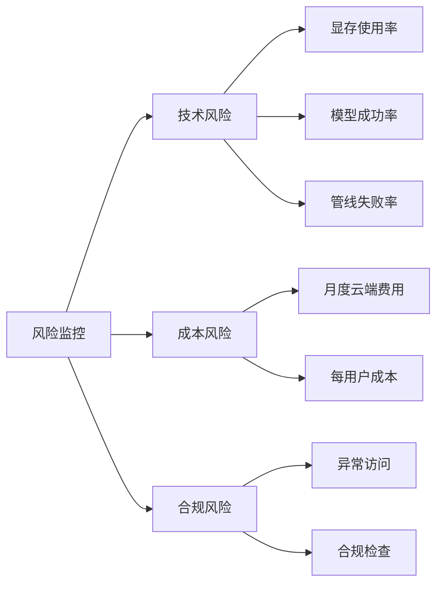

# 风险矩阵与应对措施

## 风险矩阵（概览）

| 风险ID | 风险描述 | 概率 | 影响 | 风险值 | 优先级 |
|--------|----------|------|------|--------|--------|
| R1 | 8GB显存不足 | 中 | 高 | 12 | P1 |
| R2 | 数据泄露/密钥泄露 | 低 | 极高 | 15 | P0 |
| R3 | 成本不可控 | 中 | 中 | 9 | P2 |
| R4 | 学习成本与维护高 | 高 | 中 | 12 | P1 |
| R5 | 管线对接复杂性 | 高 | 中 | 12 | P1 |
| R6 | 数据迁移失败 | 低 | 高 | 10 | P1 |
| R7 | 模型性能不达预期 | 中 | 中 | 9 | P2 |
| R8 | 云端服务中断 | 低 | 高 | 10 | P1 |
| R9 | 图数据库性能瓶颈 | 中 | 中 | 9 | P2 |
| R10 | 合规违规 | 低 | 极高 | 15 | P0 |

风险值 = 概率(1-5) × 影响(1-5)，优先级：P0(≥15), P1(10-14), P2(5-9)

---

## 详细风险分析

### R1：8GB显存不足

**描述**：本地模型（如Qwen-14B-Q4）可能无法在8GB显存下稳定运行，或推理速度过慢。

**概率**：中（3/5）  
**影响**：高（4/5）  
**风险值**：12

**应对措施**：
1. **短期**：使用更激进的量化（Q3_K_S，显存~5.5GB）
   - 效果：降低显存占用，但模型能力下降
   - 成本：无额外成本
   - 负责人：ML工程师

2. **中期**：实现云端fallback机制
   ```python
   def safe_inference(prompt):
       try:
           return local_model.generate(prompt)
       except OutOfMemoryError:
           return cloud_model.generate(prompt)
   ```
   - 效果：确保服务不中断
   - 成本：增加云端调用费用（约$0.01-0.10/次）
   - 负责人：后端

3. **长期**：升级硬件至16GB显存（如RTX 4060 Ti 16GB）
   - 效果：彻底解决显存问题
   - 成本：~$400-500
   - 负责人：管理层

**监控指标**：`nvidia-smi`显存使用率、推理超时次数

---

### R2：数据泄露/密钥泄露

**描述**：API密钥、用户数据在云端传输或存储时被泄露。

**概率**：低（2/5）  
**影响**：极高（5/5）  
**风险值**：10（但影响极大，升级为P0）

**应对措施**：
1. **预防**：
   - 所有API Key使用环境变量，不硬编码
   - 云端调用前强制脱敏（见security-compliance.md）
   - 使用HTTPS + TLS 1.3
   - 定期轮换密钥（每月）

2. **检测**：
   - 审计日志分析（异常访问模式）
   - 依赖漏洞扫描（Snyk）
   - 季度渗透测试

3. **响应**：
   - 立即撤销泄露密钥
   - 通知受影响的用户
   - 按合规要求报告监管机构

**监控指标**：异常API调用次数、未授权访问尝试

---

### R3：成本不可控

**描述**：云端API调用量暴增，导致月度成本远超预期。

**概率**：中（3/5）  
**影响**：中（3/5）  
**风险值**：9

**应对措施**：
1. **预算控制**：
   ```python
   # 月度预算检查
   DAILY_BUDGET = 100  # 美元
   
   def check_budget():
       monthly_spend = get_monthly_spend()
       if monthly_spend > DAILY_BUDGET * 30:
           raise BudgetExceeded("月度预算已用尽")
   ```

2. **速率限制**：
   - 按用户/API Key限制调用次数
   - 超过限制返回429，并提示等待时间

3. **智能路由**：
   - 简单查询优先本地模型
   - 设置token预算上限
   - 用户可选择"经济模式"（仅本地）

**监控指标**：月度累计云端费用、每用户平均成本

---

### R4：学习成本与维护高

**描述**：新架构复杂度高，团队成员需要长时间学习，运维成本高。

**概率**：高（4/5）  
**影响**：中（3/5）  
**风险值**：12

**应对措施**：
1. **文档完善**：
   - 编写详细的操作手册（wiki内）
   - 录制培训视频（关键操作）
   - 创建FAQ文档

2. **培训计划**：
   - Week 1-2：集中培训（Neo4j、FAISS、FastAPI）
   - Week 3-4：结对编程（资深带新人）
   - 持续：每月技术分享会

3. **工具简化**：
   - 开发CLI工具封装复杂操作
     ```bash
     wiki ingest raw/new-file.md  # 一行命令完成摄入
     wiki lint --fix            # 自动修复问题
     wiki stats                 # 查看统计
     ```

4. **自动化运维**：
   - CI/CD自动化部署
   - 监控告警自动化
   - 备份恢复自动化

**监控指标**：团队培训完成率、运维工单数量

---

### R5：管线对接复杂性

**描述**：ingest、query、lint等管线涉及多个组件（LLM、图DB、向量DB），对接复杂易出错。

**概率**：高（4/5）  
**影响**：中（3/5）  
**风险值**：12

**应对措施**：
1. **组件解耦**：
   - 使用接口抽象，各组件可独立替换
   ```python
   class LLMInterface(ABC):
       @abstractmethod
       def generate(self, prompt: str) -> str: pass
   
   class LocalLLM(LLMInterface): ...
   class CloudLLM(LLMInterface): ...
   ```

2. **集成测试**：
   - 每个管线都有端到端测试
   - 持续集成验证所有对接点
   - Mock外部依赖进行单元测试

3. **可视化调试**：
   - 开发管线可视化工具（显示各阶段耗时）
   - 详细的错误日志和堆栈跟踪

**监控指标**：管线成功率、各阶段平均耗时

---

### R6：数据迁移失败

**描述**：现有60个文件迁移到新架构时出现数据丢失或不一致。

**概率**：低（2/5）  
**影响**：高（4/5）  
**风险值**：8（但影响大，升级为P1）

**应对措施**：
1. **分批迁移**：
   - 先迁移10个文件作为试点
   - 验证通过后，再全量迁移

2. **双向验证**：
   ```python
   def verify_migration(file_path):
       # 旧系统读取
       legacy_data = read_legacy(file_path)
       # 新系统读取
       new_data = read_new(file_path)
       # 对比
       assert normalize(legacy_data) == normalize(new_data)
   ```

3. **回滚准备**：
   - 迁移前完整备份
   - 迁移脚本支持回滚模式
   - 验证失败自动回滚

**监控指标**：迁移成功率、数据一致性率

---

### R7：模型性能不达预期

**描述**：本地8B-14B模型在复杂推理任务上表现不佳。

**概率**：中（3/5）  
**影响**：中（3/5）  
**风险值**：9

**应对措施**：
1. **模型选型测试**：
   - 对比Qwen、DeepSeek、Llama在典型任务上的表现
   - 使用量化感知训练（QAT）提升量化模型性能

2. **Prompt优化**：
   - 针对本地模型调整prompt格式
   - 使用few-shot示例提升效果

3. **混合策略**：
   - 简单任务本地模型
   - 复杂任务云端模型
   - 用户可选择强制本地/云端

**监控指标**：任务成功率、用户满意度

---

### R8：云端服务中断

**描述**：云端API服务（OpenAI/Claude）因故障或限流无法访问。

**概率**：低（2/5）  
**影响**：高（4/5）  
**风险值**：8（但影响大，升级为P1）

**应对措施**：
1. **多厂商接入**：
   - 同时接入OpenAI、Anthropic、国内大模型
   - 自动切换至可用服务

2. **本地降级**：
   ```python
   def call_cloud_with_fallback(prompt):
       for provider in [openai, anthropic, local]:
           try:
               return provider.generate(prompt)
           except Exception:
               continue
       raise AllProvidersFailed()
   ```

3. **缓存策略**：
   - 相似查询使用缓存结果
   - 减少云端调用次数

**监控指标**：云端服务可用性、降级触发次数

---

### R9：图数据库性能瓶颈

**描述**：随着数据量增长，Neo4j查询性能下降。

**概率**：中（3/5）  
**影响**：中（3/5）  
**风险值**：9

**应对措施**：
1. **索引优化**：
   - 为常用查询字段建立索引
   - 定期分析查询计划，优化慢查询

2. **分区策略**：
   - 按时间或类型分区
   - 热点数据缓存（Redis）

3. **读写分离**：
   - 查询使用只读副本
   - 写入使用主节点

**监控指标**：查询响应时间、慢查询数量

---

### R10：合规违规

**描述**：违反GDPR、数据隐私法规，导致法律风险。

**概率**：低（2/5）  
**影响**：极高（5/5）  
**风险值**：10（但影响极大，升级为P0）

**应对措施**：
1. **合规设计**：
   - 实施数据最小化原则
   - 提供数据导出、删除接口
   - 用户同意管理机制

2. **审计准备**：
   - 完整的审计日志
   - 定期合规审查
   - 数据保护官（DPO）指定

3. **法律咨询**：
   - 聘请专业律师审核
   - 定期更新隐私政策

**监控指标**：合规检查通过率、用户投诉数量

---

## 风险应对优先级总结

| 优先级    | 风险ID               | 行动         |
| ------ | ------------------ | ---------- |
| **P0** | R2, R10            | 立即实施所有应对措施 |
| **P1** | R1, R6, R8         | 本月内完成主要应对  |
| **P2** | R3, R4, R5, R7, R9 | 纳入3个月路线图   |

---

## 风险监控仪表盘



**告警阈值**：
- 显存使用率>90%：立即告警
- 月度费用>预算110%：立即告警
- 数据泄露事件：立即告警并启动应急响应

---

## References

- [[llm-wiki-upgrade-plan]]
- [[security-compliance]]
- [[architecture-options]]
- [[roadmap-6-12-months]]
