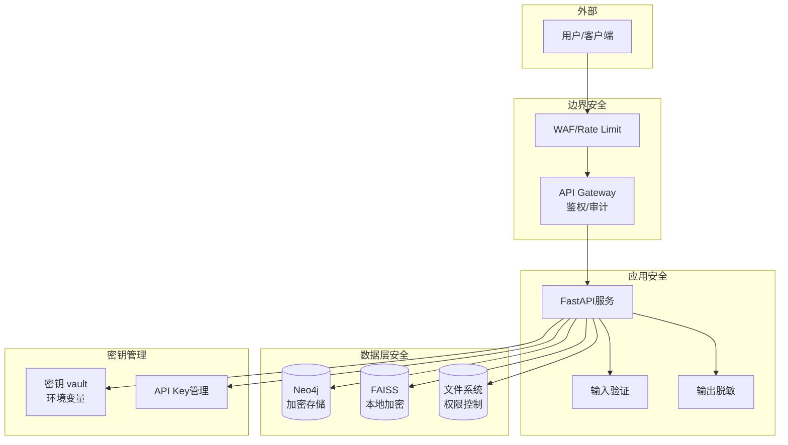

# 安全设计与合规策略

## 安全架构概览



---

## 1. 认证与鉴权

### 1.1 API Key 管理

**生成与存储**：
```python
# app/security/auth.py
import secrets
from fastapi import Header, HTTPException

def generate_api_key() -> str:
    """生成安全API Key"""
    return f"lwk-{secrets.token_urlsafe(32)}"

# 存储：使用Redis或数据库
# Key格式：lwk-<random 32 bytes>
# 哈希存储（不存明文）：SHA256 hash
```

**验证中间件**：
```python
from fastapi import Depends, HTTPException
from fastapi.security import APIKeyHeader

api_key_header = APIKeyHeader(name="X-API-Key")

async def verify_api_key(api_key: str = Depends(api_key_header)):
    # 计算哈希
    key_hash = hashlib.sha256(api_key.encode()).hexdigest()
    
    # 查询数据库/Redis
    stored_key = await db.get_api_key_by_hash(key_hash)
    if not stored_key:
        raise HTTPException(status_code=401, detail="Invalid API Key")
    
    return stored_key['user_id'], stored_key['role']
```

**权限分级**：
| 角色 | 权限 | 速率限制 |
|------|------|----------|
| `admin` | 所有操作（含/admin/*） | 1000 req/min |
| `editor` | 读写（ingest, query, lint） | 100 req/min |
| `viewer` | 只读（query, graph） | 50 req/min |
| `anonymous` | 受限查询（L1 only） | 10 req/min |

---

## 2. 数据安全

### 2.1 加密存储

**静态加密（At Rest）**：
```yaml
# docker-compose.yml
services:
  neo4j:
    environment:
      - NEO4J_dbms_security_encryption_providers=DES
      - NEO4J_dbms_security_allow__dbms__security__encryption=true
    volumes:
      - neo4j-data:/data
      - ./certs:/certs  # SSL证书
    command: >
      --dbms.security.encryption.keystore.password=${KEYSTORE_PASSWORD}
```

**文件系统加密（可选）**：
```bash
# 使用LUKS或VeraCrypt加密数据目录
cryptsetup luksFormat /dev/sdX
cryptsetup open /dev/sdX wiki-enc
mkfs.ext4 /dev/mapper/wiki-enc
mount /dev/mapper/wiki-enc /mnt/wiki-secure
```

### 2.2 传输加密（In Transit）

**HTTPS/TLS配置**：
```python
# app/main.py
from fastapi import FastAPI
import uvicorn

app = FastAPI()

if __name__ == "__main__":
    uvicorn.run(
        app,
        host="0.0.0.0",
        port=8000,
        ssl_keyfile="/certs/key.pem",
        ssl_certfile="/certs/cert.pem"
    )
```

**数据库连接加密**：
```python
# Neo4j使用Bolt+ssl协议
neo4j_uri = "bolt+ssc://localhost:7687"  # ssc = self-signed cert
driver = GraphDatabase.driver(
    neo4j_uri,
    auth=basic_auth("neo4j", password),
    encrypted=True
)
```

---

## 3. 输入验证与防注入

### 3.1 输入验证
```python
# app/schemas.py
from pydantic import BaseModel, validator, Field
import re

class QueryRequest(BaseModel):
    query: str = Field(..., min_length=1, max_length=2000)
    level: str = Field(default="auto", regex="^(auto|L1|L2|L3)$")
    top_k: int = Field(default=5, ge=1, le=50)
    
    @validator('query')
    def no_sql_injection(cls, v):
        # 检测Cypher注入（如果是直接拼接）
        dangerous = ["MATCH", "CREATE", "DELETE", "DROP", ";"]
        for keyword in dangerous:
            if keyword in v.upper():
                raise ValueError(f"非法关键词: {keyword}")
        return v
```

### 3.2 输出脱敏
```python
# app/security/sanitizer.py
import re

class DataSanitizer:
    # 检测敏感信息模式
    SENSITIVE_PATTERNS = {
        'api_key': r'(sk-|lwk-)[a-zA-Z0-9_\-]{20,}',
        'email': r'[a-zA-Z0-9._%+-]+@[a-zA-Z0-9.-]+\.[a-zA-Z]{2,}',
        'phone': r'(\+?\d{1,3}[-.\s]?)?\(?\d{3}\)?[-.\s]?\d{3,4}[-.\s]?\d{4}',
        'id_card': r'\d{17}[\dXx]',  # 中国身份证
        'credit_card': r'\d{4}[-\s]?\d{4}[-\s]?\d{4}[-\s]?\d{4}'
    }
    
    def sanitize(self, text: str, mask_char="*") -> str:
        """脱敏敏感信息"""
        for pattern_name, pattern in self.SENSITIVE_PATTERNS.items():
            matches = re.finditer(pattern, text)
            for match in matches:
                start, end = match.span()
                text = text[:start] + mask_char * (end - start) + text[end:]
        return text
```

---

## 4. 云端调用安全（混合架构）

### 4.1 数据脱敏管道
```python
# app/security/cloud_pipeline.py
class CloudSafePipeline:
    def __init__(self):
        self.sanitizer = DataSanitizer()
        self.ner_model = load_ner_model()  # 本地NER模型
    
    def prepare_for_cloud(self, text: str) -> str:
        """发送到云端前脱敏"""
        # 1. 使用NER识别实体
        entities = self.ner_model.extract(text)
        
        # 2. 脱敏
        for ent in entities:
            if ent.label_ in ['PERSON', 'ORG', 'LOC', 'DATE']:
                text = text.replace(ent.text, f"[{ent.label_}_REDACTED]")
        
        # 3. 正则表达式脱敏（兜底）
        text = self.sanitizer.sanitize(text)
        
        return text
```

### 4.2 云端API Key管理
```python
# 使用环境变量，不硬编码
import os

OPENAI_API_KEY = os.getenv("OPENAI_API_KEY")
if not OPENAI_API_KEY:
    raise ValueError("OPENAI_API_KEY not set")

# 或存储在密钥管理服务（如AWS Secrets Manager）
# import boto3
# client = boto3.client('secretsmanager')
# api_key = client.get_secret_value(SecretId='openai-key')['SecretString']
```

---

## 5. 审计与日志

### 5.1 审计日志格式
```python
# app/logging/audit.py
import json
import time
from datetime import datetime

class AuditLogger:
    def log_api_call(self, user_id, endpoint, params, response_code):
        log_entry = {
            "timestamp": datetime.utcnow().isoformat(),
            "user_id": user_id,
            "endpoint": endpoint,
            "params_hash": hashlib.sha256(json.dumps(params).encode()).hexdigest(),
            "response_code": response_code,
            "source_ip": request.client.host
        }
        
        # 写入审计日志文件（不可篡改）
        with open("/var/log/wiki/audit.log", "a") as f:
            f.write(json.dumps(log_entry) + "\n")
```

### 5.2 日志保护
```yaml
# 日志配置（防止敏感信息泄露）
logging:
  version: 1
  disable_existing_loggers: false
  filters:
    sensitive_filter:
      (): app.logging.SensitiveFilter
  handlers:
    audit_file:
      class: logging.handlers.RotatingFileHandler
      filename: /var/log/wiki/audit.log
      maxBytes: 10485760  # 10MB
      backupCount: 30
      filters: [sensitive_filter]
  root:
    level: INFO
    handlers: [audit_file]
```

---

## 6. 合规策略

### 6.1 数据最小化
```python
# 仅收集和存储必要数据
class DataMinimizer:
    @staticmethod
    def minimize_query_log(query: str) -> dict:
        """仅记录查询的元数据，不存完整查询"""
        return {
            "query_hash": hashlib.sha256(query.encode()).hexdigest(),
            "query_length": len(query),
            "timestamp": datetime.utcnow().isoformat(),
            # 不存储 query 原文
        }
```

### 6.2 访问控制（RBAC）
```cypher
// Neo4j中定义权限
CREATE CONSTRAINT ON (u:User) ASSERT u.username IS UNIQUE;

// 用户节点
CREATE (u:User {
  username: 'editor1',
  role: 'editor',
  created_at: datetime()
})

// 权限检查（在应用层）
MATCH (u:User {username: $username})
WHERE u.role IN ['admin', 'editor']
RETURN u
```

### 6.3 数据保留与删除（GDPR合规）
```python
# 实现"被遗忘权"
class DataRetentionManager:
    def delete_user_data(self, user_id: str):
        # 1. 删除Neo4j中的用户节点
        neo4j.run("MATCH (u:User {id: $id}) DETACH DELETE u", id=user_id)
        
        # 2. 删除FAISS中的向量（标记为删除）
        faiss.mark_deleted(user_id)
        
        # 3. 删除审计日志中的用户标识（匿名化）
        self.anonymize_audit_logs(user_id)
        
        # 4. 刷新缓存
        self.clear_user_cache(user_id)
```

---

## 7. 漏洞防护

### 7.1 OWASP Top 10 防护
| 漏洞 | 防护措施 |
|------|----------|
| **A1: 注入** | 参数化查询、输入验证、ORM/ODM |
| **A2: 认证失效** | 强密码策略、MFA、JWT过期 |
| **A3: 敏感数据暴露** | HTTPS、加密存储、脱敏 |
| **A4: XML外部实体** | 禁用XML解析（使用JSON） |
| **A5: 访问控制失效** | RBAC、权限检查 |
| **A6: 安全配置错误** | 安全基线、最小权限 |
| **A7: XSS** | 输出编码、CSP头 |
| **A8: 不安全反序列化** | 不使用pickle，使用JSON |
| **A9: 已知漏洞** | 依赖扫描（Snyk/Dependabot） |
| **A10: 日志监控不足** | 集中日志、告警 |

### 7.2 依赖安全扫描
```yaml
# .github/workflows/security.yml
name: Security Scan
on: [push, pull_request]

jobs:
  security:
    runs-on: ubuntu-latest
    steps:
      - uses: actions/checkout@v3
      - name: Run Snyk
        uses: snyk/actions/python@master
        env:
          SNYK_TOKEN: ${{ secrets.SNYK_TOKEN }}
      - name: Run Bandit (Python安全扫描)
        run: |
          pip install bandit
          bandit -r app/ -f json -o bandit-report.json
```

---

## 8. 应急响应计划

### 8.1 数据泄露响应
1. **检测**：监控系统告警（异常访问、大量数据导出）
2. **遏制**：立即撤销受影响API Key，隔离数据库
3. **调查**：审计日志分析，确定泄露范围
4. **通知**：按合规要求通知用户/监管机构
5. **恢复**：从备份恢复，加强防护

### 8.2 密钥泄露响应
```bash
# 1. 立即轮换密钥
export NEW_OPENAI_KEY="sk-new-key-here"

# 2. 更新所有服务
docker-compose restart api

# 3. 撤销旧密钥（在云服务商控制台）
# 4. 审计日志，检查旧密钥是否被滥用
```

---

## 9. 合规检查清单

### GDPR 合规
- [ ] 明确数据收集目的（隐私政策）
- [ ] 用户同意机制（opt-in）
- [ ] 数据最小化（仅收集必要数据）
- [ ] 被遗忘权实现（数据删除接口）
- [ ] 数据可携带性（导出接口）
- [ ] 数据保护官（DPO）指定

### 内部安全审计
- [ ] 季度渗透测试
- [ ] 年度安全评估
- [ ] 代码安全审查（每次发布前）
- [ ] 依赖漏洞扫描（持续）

---

## References

- [[llm-wiki-upgrade-plan]]
- [[architecture-options]]
- [[testing-qa-strategy]]
- [[risk-mitigation]]
