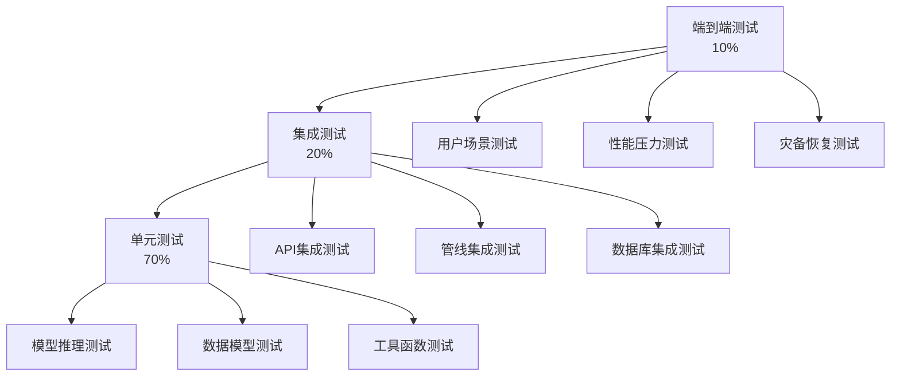

# 测试策略与质量保证

## 测试金字塔



---

## 1. 单元测试（Unit Tests）

### 1.1 模型推理测试
**目标**：验证本地模型加载、推理、量化正确性

**测试框架**：pytest + pytest-asyncio

```python
# tests/unit/test_model.py
import pytest
from app.models.loader import ModelLoader

class TestModelLoader:
    def test_model_load_qwen14b_q4(self):
        """测试Qwen-14B-Q4模型加载"""
        loader = ModelLoader(model_name="qwen-14b-q4")
        model = loader.load()
        
        assert model is not None
        assert model.device.type == "cuda"
        assert model.config.max_seq_length >= 8192
    
    def test_inference_speed(self):
        """测试推理速度（>10 tok/s）"""
        model = ModelLoader("qwen-14b-q4").load()
        prompt = "请解释Transformer架构"
        
        import time
        start = time.time()
        output = model.generate(prompt, max_tokens=100)
        elapsed = time.time() - start
        
        tokens_per_second = 100 / elapsed
        assert tokens_per_second > 10, f"速度过慢: {tokens_per_second} tok/s"
    
    def test_vram_usage(self):
        """测试显存占用（<8GB）"""
        model = ModelLoader("qwen-14b-q4").load()
        
        import torch
        vram_used = torch.cuda.memory_allocated() / 1024**3  # GB
        assert vram_used < 8, f"显存占用过高: {vram_used}GB"
```

### 1.2 数据模型测试
**目标**：验证图数据库、向量数据库的CRUD操作

```python
# tests/unit/test_graph.py
class TestGraphDB:
    def test_create_page_node(self, neo4j_driver):
        """测试创建Page节点"""
        db = GraphDB(neo4j_driver)
        page_id = "test/concept"
        
        db.create_page(
            id=page_id,
            title="测试概念",
            type="concept",
            tags=["test"]
        )
        
        node = db.get_page(page_id)
        assert node is not None
        assert node['title'] == "测试概念"
        assert node['type'] == "concept"
    
    def test_create_wikilink_relation(self, neo4j_driver):
        """测试创建wikilink关系"""
        db = GraphDB(neo4j_driver)
        
        db.create_page("A", "Page A", "concept")
        db.create_page("B", "Page B", "concept")
        db.create_wikilink("A", "B", weight=1.0)
        
        links = db.get_outgoing_links("A")
        assert len(links) == 1
        assert links[0]['id'] == "B"
```

### 1.3 工具函数测试
```python
# tests/unit/test_utils.py
class TestWikilinkExtractor:
    def test_extract_simple_link(self):
        """测试提取简单wikilink"""
        from app.utils.wikilink import extract_wikilinks
        
        content = "这是一个[[concepts/llm]]的链接"
        links = extract_wikilinks(content)
        
        assert len(links) == 1
        assert links[0].target == "concepts/llm"
    
    def test_extract_link_with_alias(self):
        """测试提取带别名的wikilink"""
        content = "这是[[concepts/llm|大型语言模型]]的链接"
        links = extract_wikilinks(content)
        
        assert links[0].target == "concepts/llm"
        assert links[0].alias == "大型语言模型"
```

**单元测试覆盖率目标**：>80%

---

## 2. 集成测试（Integration Tests）

### 2.1 API集成测试
**测试框架**：FastAPI TestClient + pytest

```python
# tests/integration/test_api.py
from fastapi.testclient import TestClient
from app.main import app

client = TestClient(app)

class TestQueryAPI:
    def test_query_L1_returns_metadata(self):
        """测试L1查询仅返回元数据"""
        response = client.post("/api/v2/query", json={
            "query": "Transformer",
            "level": "L1",
            "top_k": 3
        })
        
        assert response.status_code == 200
        data = response.json()
        assert data['level'] == 'L1'
        assert 'total_tokens_used' in data
        assert data['total_tokens_used'] < 500  # L1应该只用很少token
    
    def test_query_L3_returns_full_answer(self):
        """测试L3查询返回完整回答"""
        response = client.post("/api/v2/query", json={
            "query": "对比RAG和CAG",
            "level": "L3"
        })
        
        assert response.status_code == 200
        data = response.json()
        assert 'answer' in data
        assert len(data['answer']) > 100
        assert 'sources' in data
    
    def test_query_with_auth(self):
        """测试API鉴权"""
        response = client.post("/api/v2/query", 
            json={"query": "test"},
            headers={"X-API-Key": "invalid-key"}
        )
        
        assert response.status_code == 401
```

### 2.2 Ingest管线集成测试
```python
class TestIngestPipeline:
    def test_ingest_markdown_file(self, tmp_path):
        """测试摄入Markdown文件"""
        # 创建测试文件
        test_file = tmp_path / "test.md"
        test_file.write_text("""
---
title: 测试文档
type: source
tags: [test]
---
# 测试内容
这是一个[[concepts/llm]]的引用。
        """)
        
        response = client.post("/api/v2/ingest", json={
            "source": str(test_file),
            "options": {"auto_categorize": True}
        })
        
        assert response.status_code == 200
        data = response.json()
        assert data['status'] == 'completed'
        assert len(data['created_pages']) > 0
    
    def test_ingest_creates_graph_edges(self):
        """测试ingest后图数据库更新"""
        # 先ingest
        client.post("/api/v2/ingest", json={"source": "raw/test.md"})
        
        # 检查图数据库
        db = GraphDB()
        edges = db.get_outgoing_links("sources/test")
        assert len(edges) > 0  # 应该创建了wikilink边
```

### 2.3 数据库集成测试
```python
class TestDatabaseIntegration:
    def test_neo4j_faiss_sync(self):
        """测试Neo4j和FAISS数据一致性"""
        # 创建页面
        page_id = "test/sync"
        create_page_in_both(page_id)
        
        # 检查Neo4j
        neo4j_node = neo4j.get_page(page_id)
        # 检查FAISS
        faiss_vector = faiss_index.get_vector(page_id)
        
        assert neo4j_node is not None
        assert faiss_vector is not None
```

**集成测试覆盖率目标**：>70%

---

## 3. 端到端测试（E2E Tests）

### 3.1 用户场景测试
```python
# tests/e2e/test_user_scenarios.py
class TestUserScenarios:
    def test_full_ingest_query_cycle(self):
        """测试完整的ingest-query流程"""
        # 1. Ingest新文档
        ingest_resp = client.post("/api/v2/ingest", json={
            "source": "raw/new-paper.md"
        })
        assert ingest_resp.status_code == 200
        created = ingest_resp.json()['created_pages']
        
        # 2. 查询新内容
        query_resp = client.post("/api/v2/query", json={
            "query": "新论文的核心思想",
            "level": "L3"
        })
        assert query_resp.status_code == 200
        answer = query_resp.json()['answer']
        assert "新论文" in answer or "核心" in answer
        
        # 3. 检查图谱更新
        graph_resp = client.get("/api/v2/graph/nodes", 
            params={"id": created[0]['id']}
        )
        assert graph_resp.status_code == 200
    
    def test_lint_and_fix_cycle(self):
        """测试lint检测并自动修复"""
        # 1. 手动创建一个断链
        create_page_with_broken_link()
        
        # 2. 运行lint
        lint_resp = client.post("/api/v2/lint", json={
            "checks": ["broken_links"]
        })
        assert lint_resp.json()['summary']['broken_links'] > 0
        
        # 3. 自动修复
        fix_resp = client.post("/api/v2/lint/fix", json={
            "lint_id": lint_resp.json()['lint_id'],
            "fix_types": ["broken_links"]
        })
        assert fix_resp.status_code == 200
        
        # 4. 再次lint，确认修复
        lint_resp2 = client.post("/api/v2/lint")
        assert lint_resp2.json()['summary']['broken_links'] == 0
```

### 3.2 性能压力测试
**工具**：Locust / k6

```python
# tests/e2e/load_test.py (Locust)
from locust import HttpUser, task, between

class WikiUser(HttpUser):
    wait_time = between(1, 3)
    
    @task(10)
    def query_L1(self):
        self.client.post("/api/v2/query", json={
            "query": "Transformer",
            "level": "L1"
        })
    
    @task(5)
    def query_L3(self):
        self.client.post("/api/v2/query", json={
            "query": "对比RAG和CAG的优缺点",
            "level": "L3"
        })
    
    @task(1)
    def ingest(self):
        with open("tests/fixtures/sample.md", "rb") as f:
            self.client.post("/api/v2/ingest", 
                files={"file": f}
            )

# 运行：locust -f load_test.py --host=http://localhost:8000
# 目标：100并发用户，P99延迟<1s
```

**性能测试目标**：
- P50响应时间：<100ms（L1），<500ms（L3）
- P99响应时间：<200ms（L1），<1s（L3）
- 吞吐量：50 QPS（L1），10 QPS（L3）
- 错误率：<1%

---

## 4. 健康检查与自测

### 4.1 自动化健康检查
```python
# app/health.py
class HealthChecker:
    def check_all(self):
        results = {
            "status": "healthy",
            "checks": {}
        }
        
        # 检查模型
        try:
            model = get_model()
            model.generate("test", max_tokens=1)
            results['checks']['model'] = {"status": "ok"}
        except Exception as e:
            results['checks']['model'] = {"status": "error", "detail": str(e)}
            results['status'] = "degraded"
        
        # 检查数据库
        try:
            neo4j = get_neo4j()
            neo4j.run("RETURN 1")
            results['checks']['neo4j'] = {"status": "ok"}
        except Exception as e:
            results['checks']['neo4j'] = {"status": "error", "detail": str(e)}
            results['status'] = "degraded"
        
        # 检查向量库
        try:
            faiss = get_faiss()
            count = faiss.count()
            results['checks']['faiss'] = {"status": "ok", "vectors": count}
        except Exception as e:
            results['checks']['faiss'] = {"status": "error", "detail": str(e)}
            results['status'] = "unhealthy"
        
        return results
```

### 4.2 自检/自纠（Lint 2.0）
```python
class SelfChecker:
    def check_orphaned_pages(self):
        """检测孤立页面（无入链）"""
        query = """
        MATCH (p:Page)
        WHERE NOT (()-[:LINKS_TO]->(p))
        RETURN p.id as orphan
        """
        return neo4j.run(query).data()
    
    def check_broken_links(self):
        """检测断链（指向不存在的页面）"""
        # 从index-cache.json获取所有有效页面
        valid_pages = set(index_cache.keys())
        
        # 检查所有wikilink
        broken = []
        for page_id, data in index_cache.items():
            for edge in data.get('edges', []):
                if edge['to'] not in valid_pages:
                    broken.append({
                        'from': page_id,
                        'to': edge['to']
                    })
        return broken
    
    def check_semantic_consistency(self):
        """检测语义不一致（标题与内容不匹配）"""
        inconsistent = []
        for page_id, data in index_cache.items():
            title_embedding = embed(data['title'])
            content_embedding = embed(data.get('summary', ''))
            
            similarity = cosine_similarity(title_embedding, content_embedding)
            if similarity < 0.5:  # 阈值
                inconsistent.append({
                    'page': page_id,
                    'similarity': similarity
                })
        return inconsistent
```

---

## 5. 回滚策略

### 5.1 数据库回滚
```python
# 每天自动备份
class BackupManager:
    def daily_backup(self):
        # Neo4j dump
        neo4j_dump = neo4j.backup()
        upload_to_s3(neo4j_dump, "backups/neo4j/")
        
        # FAISS snapshot
        faiss_snapshot = faiss.create_snapshot()
        upload_to_s3(faiss_snapshot, "backups/faiss/")
        
        # index-cache.json
        copy_to_s3("wiki/index-cache.json", "backups/")
    
    def restore(self, backup_date):
        # 恢复Neo4j
        neo4j.restore(f"s3://backups/neo4j/{backup_date}")
        # 恢复FAISS
        faiss.restore(f"s3://backups/faiss/{backup_date}")
        # 恢复缓存
        download_from_s3(f"s3://backups/index-cache-{backup_date}.json")
```

### 5.2 版本回滚
```bash
# 使用git tag管理版本
git tag -a v2.0.0 -m "Release v2.0.0"
git push origin v2.0.0

# 回滚到上一版本
git checkout v1.5.0
docker-compose down
docker-compose up -d

# 数据库迁移回滚（如有schema变更）
alembic downgrade -1
```

---

## 6. 测试计划时间表

| 阶段 | 时间 | 测试重点 | 完成标准 |
|------|------|----------|----------|
| M1 | Week 2 | 单元测试（模型、数据库） | 覆盖率>60% |
| M2 | Week 6 | 集成测试（API、管线） | 核心流程通过 |
| M3 | Week 10 | 端到端测试（用户场景） | 主要场景覆盖 |
| M4 | Week 14 | 性能测试、压力测试 | P99<1s，错误率<1% |
| M5 | Week 18 | 健康检查、自测 | Lint 2.0上线 |
| M6 | Week 22 | 全量回归测试 | 所有测试通过 |
| M7-12 | 持续 | 自动化测试、监控 | CI/CD集成 |

---

## 7. QA检查清单

### 代码审查检查点
- [ ] 所有API端点有输入验证
- [ ] 敏感信息不记录日志
- [ ] 错误处理覆盖所有异常路径
- [ ] 数据库操作有事务管理
- [ ] 模型推理有超时保护

### 发布前检查
- [ ] 所有单元测试通过
- [ ] 集成测试通过率>95%
- [ ] 性能测试达标
- [ ] 安全扫描无高危漏洞
- [ ] 文档已更新
- [ ] 备份已验证

---

## References

- [[llm-wiki-upgrade-plan]]
- [[roadmap-6-12-months]]
- [[security-compliance]]
