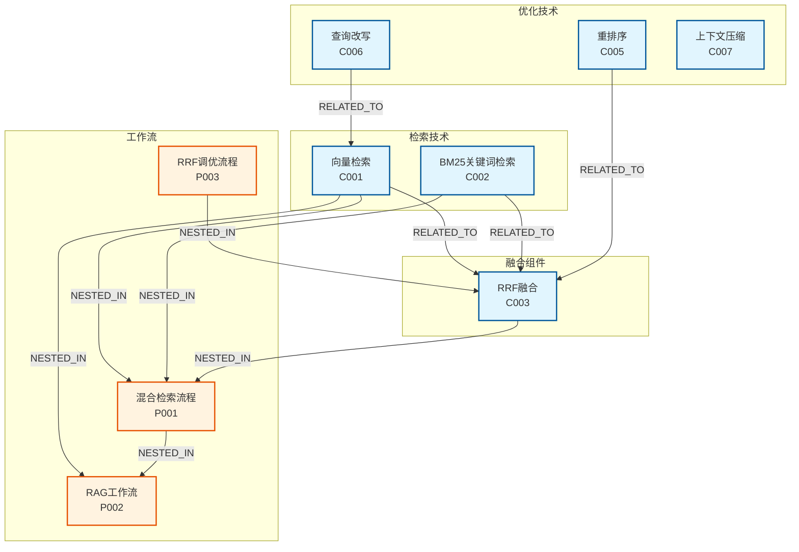

# RAG知识图谱 - 可视化展示

## Mermaid 关系图



## 节点列表

| 节点ID | 类型 | 名称 | 描述 |
|--------|------|------|------|
| C001 | Concept | 向量检索 | 将文本转为embedding向量，用余弦相似度匹配 |
| C002 | Concept | BM25关键词检索 | 基于词项频率和逆文档频率的统计排序 |
| C003 | Concept | RRF融合 | 倒数排名融合，公式：Score = Σ(1/(k+rank))，k=60 |
| C004 | Concept | 混合检索 | 向量检索 + BM25，用RRF融合结果 |
| C005 | Concept | 重排序 | 用交叉编码器对检索结果统一相关性打分 |
| C006 | Concept | 查询改写 | 用LLM重写用户查询，提升召回率 |
| C007 | Concept | 上下文压缩 | 只提取与问题相关的段落，减少token浪费 |
| P001 | Pattern | 混合检索流程 | RAG的核心检索流程 |
| P002 | Pattern | RAG工作流 | 检索增强生成的完整流程 |
| P003 | Pattern | RRF调优流程 | k值调优的标准方法 |

## 边列表

| 边ID | 类型 | 源 | 目标 | 描述 |
|------|------|-----|------|------|
| E001 | RELATED_TO | C001 | C003 | 向量检索结果送入RRF融合 |
| E002 | RELATED_TO | C002 | C003 | BM25结果送入RRF融合 |
| E003 | NESTED_IN | C003 | P001 | RRF是混合检索的核心组件 |
| E004 | RELATED_TO | C001 | P001 | 向量检索是混合检索的一部分 |
| E005 | RELATED_TO | C002 | P001 | BM25是混合检索的一部分 |
| E006 | RELATED_TO | C005 | C003 | 重排序作为RRF的后处理 |
| E007 | RELATED_TO | C006 | C001 | 改写后的查询送入向量检索 |
| E008 | NESTED_IN | C001 | P002 | 向量检索是RAG流程的检索环节 |
| E009 | NESTED_IN | P003 | C003 | 调优流程针对RRF参数 |

## 图谱交互方式

### 方式1：Mermaid预览
在支持Mermaid的编辑器（如Typora、VS Code）中打开此文件，可直接预览图谱。

### 方式2：在线预览
复制Mermaid代码到 https://mermaid.live/ 可在线生成PNG/SVG图片。

### 方式3：Neo4j导入
```cypher
// 创建节点
CREATE (c001:Concept {id:'C001', name:'向量检索', description:'将文本转为embedding向量，用余弦相似度匹配'})
CREATE (c002:Concept {id:'C002', name:'BM25关键词检索', description:'基于词项频率和逆文档频率的统计排序'})
CREATE (c003:Concept {id:'C003', name:'RRF融合', description:'倒数排名融合，公式：Score = Σ(1/(k+rank))，k=60'})
// ... 更多节点

// 创建边
MATCH (a:C001), (b:C003) CREATE (a)-[:RELATED_TO]->(b)
MATCH (a:C002), (b:C003) CREATE (a)-[:RELATED_TO]->(b)
// ... 更多边
```

## 数据文件

图谱数据已保存为JSON格式，可用于程序化处理：

```json
{
  "nodes": [
    {"id": "C001", "type": "Concept", "name": "向量检索"},
    {"id": "C002", "type": "Concept", "name": "BM25关键词检索"},
    {"id": "C003", "type": "Concept", "name": "RRF融合"},
    {"id": "P001", "type": "Pattern", "name": "混合检索流程"}
  ],
  "edges": [
    {"from": "C001", "to": "C003", "type": "RELATED_TO"},
    {"from": "C002", "to": "C003", "type": "RELATED_TO"},
    {"from": "C003", "to": "P001", "type": "NESTED_IN"}
  ]
}
```

## References

- [[wiki/my-learning-path/practice/code-graph-agent/graph/nodes|图谱节点定义]]
- [[wiki/my-learning-path/practice/code-graph-agent/graph/edges|图谱边定义]]
- [[wiki/my-learning-path/theory/rag-theory|RAG技术原理]]