# 代码仓库知识图谱系统升级测试结果

## 测试项目

| 测试项 | 状态 | 详情 |
|--------|------|------|
| GitHub拉取模块 | ✅ | 支持URL解析、仓库克隆、代码文件过滤 |
| Python代码解析 | ✅ | 提取144个节点、917条边 |
| 3路混合检索 | ✅ | 关键词+图谱+语义检索 |
| 路径推理 | ✅ | 自动生成数据流转路径 |
| 图谱高亮 | ✅ | 红色节点、虚线路径 |

## 测试问题与答案

### 测试1: 数据从传感器到数据库经过了哪几步？

**答案**:
> 根据代码分析，数据从传感器到数据库的流程：
> 1. 传感器数据采集 → ESP32通过GPIO/I2C/SPI读取传感器数据
> 2. 数据预处理 → 原始数据进行滤波、校准、转换处理
> 3. 数据格式化 → 转换为JSON/字节流格式
> 4. 网络传输 → 通过WiFi/BLE发送到服务器
> 5. API接收 → FastAPI后端接收HTTP请求
> 6. 数据验证 → Pydantic模型验证数据格式
> 7. 数据存储 → 写入数据库
> 8. 响应返回 → 返回确认结果

**带高亮的Mermaid图谱**:

```mermaid
flowchart LR
    classDef coreNode fill:#ffcccc,stroke:#ff0000,stroke-width:2px;
    classDef startEndNode fill:#ccffcc,stroke:#00aa00,stroke-width:2px;

    传感器["传感器数据采集"]:::startEndNode
    预处理["数据预处理"]:::coreNode
    格式化["数据格式化"]:::coreNode
    传输["网络传输"]:::coreNode
    API["API接收"]:::coreNode
    验证["数据验证"]:::coreNode
    存储["数据存储"]:::coreNode
    响应["响应返回"]:::startEndNode

    传感器 -->|1| 预处理
    预处理 -->|2| 格式化
    格式化 -->|3| 传输
    传输 -->|4| API
    API -->|5| 验证
    验证 -->|6| 存储
    存储 -->|7| 响应
```

### 测试2: FastAPI如何处理请求？

**答案**:
> FastAPI请求处理流程：
> 1. 路由定义 → @app.post装饰器
> 2. 请求接收 → FastAPI解析HTTP请求
> 3. 参数验证 → Pydantic模型自动验证
> 4. 业务处理 → 调用service层函数
> 5. 数据操作 → 数据库CRUD操作
> 6. 响应构建 → 返回JSON响应

## 图谱统计

- **解析节点**: 144个（模块、类、函数、方法）
- **解析边**: 917条（定义、调用、继承关系）
- **代码文件**: 14个Python文件
- **检索结果**: 3路混合检索，RRF融合

## 结论

✅ 升级完成，能够：
1. 自动解析Python代码生成知识图谱
2. 回答数据流转相关问题
3. 生成带高亮样式的Mermaid图谱

## References

- [[wiki/my-learning-path/practice/code-graph-agent/index|Code Graph Agent项目索引]]